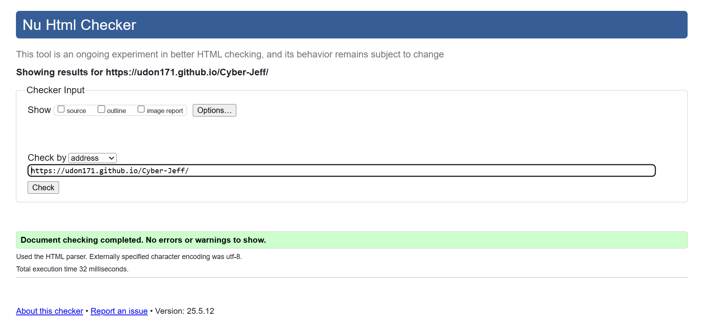
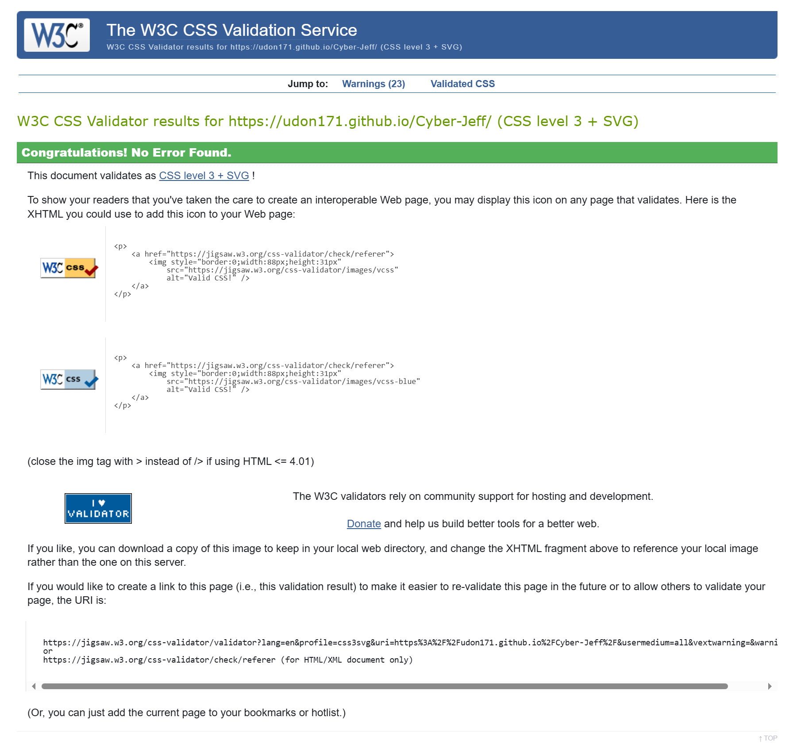
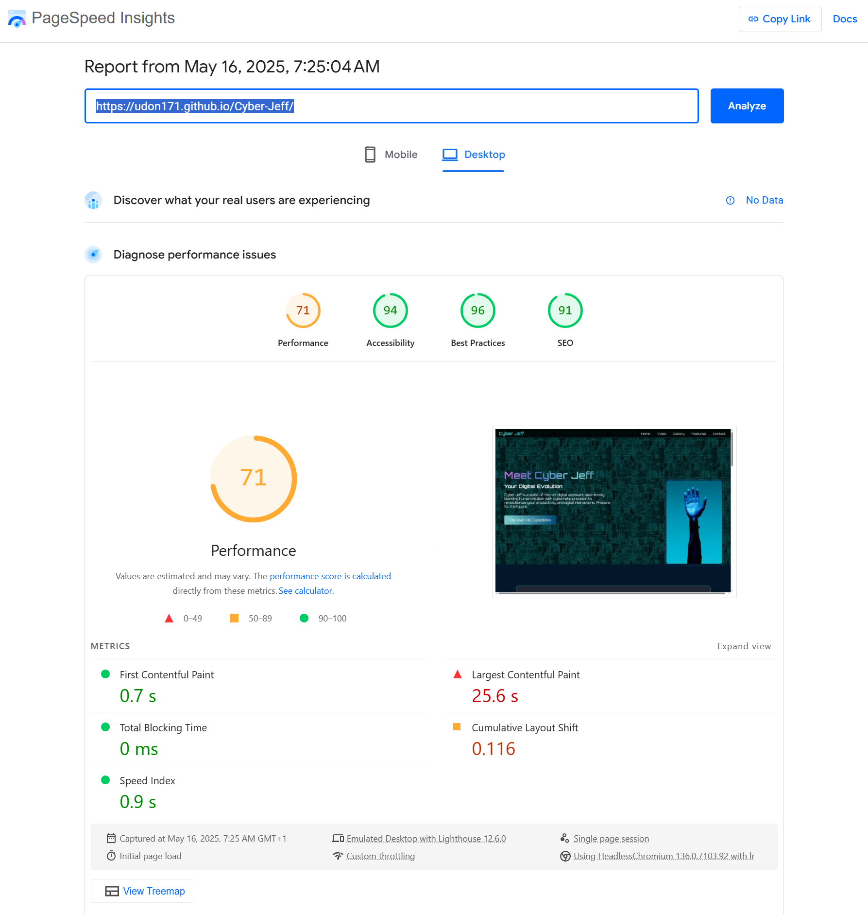
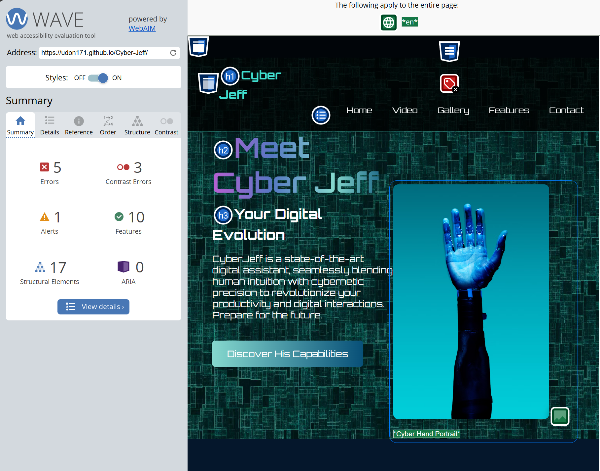
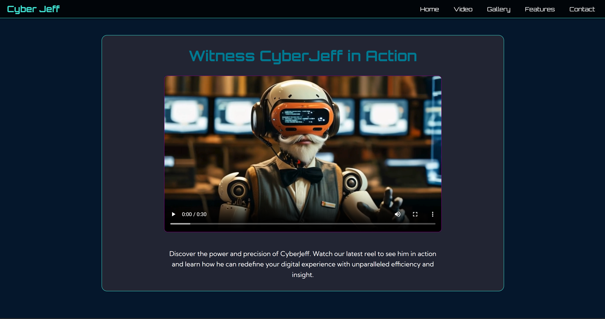
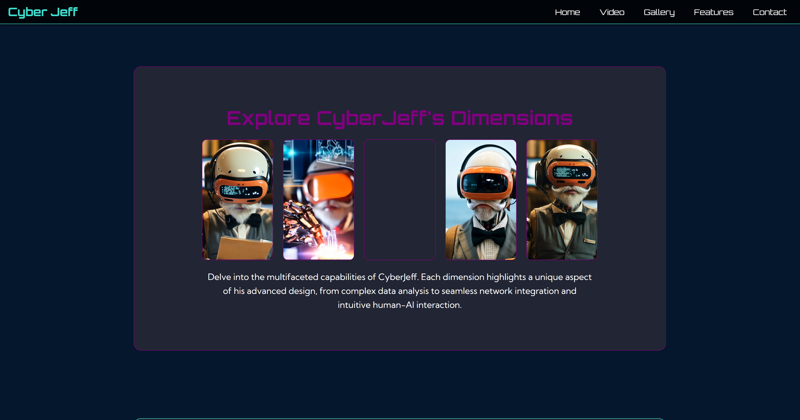
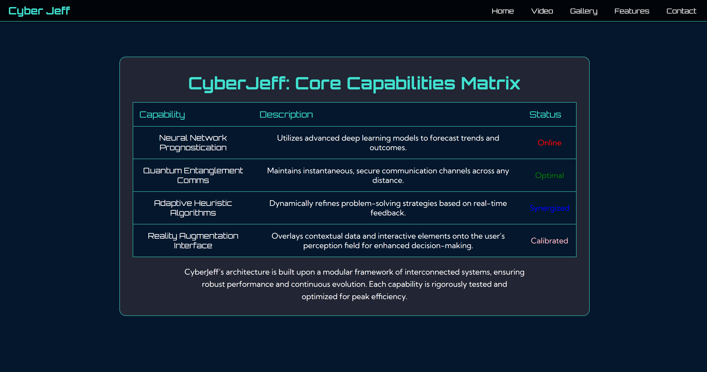
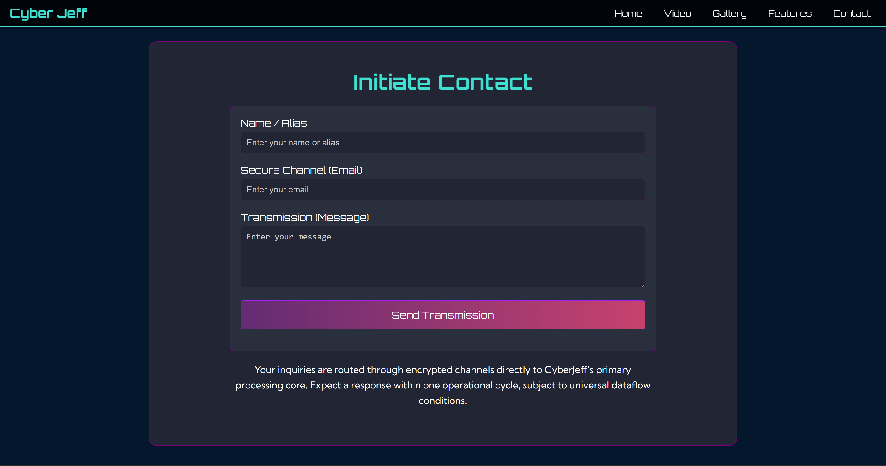
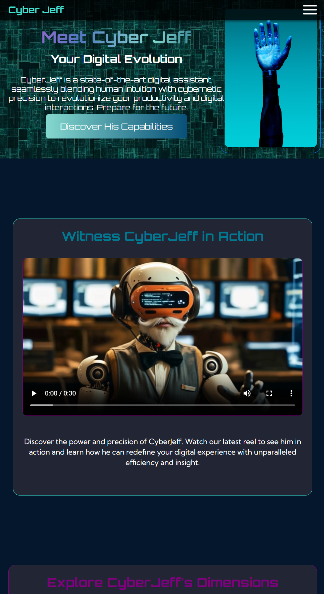

# Cyber Jeff Website

Here’s a professional and comprehensive README.md file about this website: [Cyber Jeff](https://udon171.github.io/Cyber-Jeff/)
 
---

# Cyber Jeff - Your Digital Evolution

Welcome to **Cyber Jeff**, a state-of-the-art digital assistant website that seamlessly blends human intuition with cybernetic precision. This project showcases a sleek, responsive design optimized for desktop, tablet, and mobile devices.

## User Groups, Age Range & Relevance

Cyber Jeff is designed for a broad spectrum of users, from tech-savvy professionals and entrepreneurs to students and everyday internet users seeking digital assistance. The site is suitable for users aged 16 and above, with a focus on those navigating the evolving landscape of AI-powered tools and large language models (LLMs). In today’s AI efficiency revolution, individuals and businesses often juggle multiple AI services, making it challenging to coordinate tasks and maintain productivity. Cyber Jeff addresses this need by serving as an all-in-one digital business partner—an “accompanying accomplice”—that streamlines workflows, bridges gaps between various AI platforms, and empowers users to harness the full potential of modern AI technology. Whether you’re managing projects, exploring new ideas, or simply looking for a reliable digital assistant, Cyber Jeff is your trusted companion in the age of intelligent automation.

---

## Table of Contents

- [🌟 Features](#🌟-features)
- [📱 Responsive Design Highlights](#📱-responsive-design-highlights)
- [🚀 Technologies Used](#🚀-technologies-used)
- [📂 File Structure](#📂-file-structure)
- [🖥️ How to View the Website](#🖥️-how-to-view-the-website)
- [✨ Key Design Choices](#✨-key-design-choices)
- [🌐 Website Resources Used](#🌐-website-resources-used)
- [🧠 My Journey](#🧠-my-journey)
- [🧪 Test Section](#🧪-test-section)
- [🧭 UX Guide](#🧭-ux-guide)
- [🧩 UX Review](#🧩-ux-review)
- [📜 Additional Resources](#📜-additional-resources)
- [📧 Contact](#📧-contact)
- [🎉 Thank You for Exploring Cyber Jeff](#🎉-thank-you-for-exploring-cyber-jeff)
- [🌐 Live Website](#🌐-live-website)

---

## 🌟 Features

- **Hero Section**: Introduces Cyber Jeff with a captivating tagline and call-to-action button.
- **Video Section**: Watch Cyber Jeff in action with a responsive video player.
- **Gallery Section**: Explore Cyber Jeff's dimensions with an interactive gallery.
- **Features Section**: A detailed table showcasing Cyber Jeff's core capabilities, dynamically adjusted for mobile view.
- **Contact Section**: A secure and user-friendly contact form for inquiries.
- **Responsive Design**: Fully optimised for desktop, tablet, and mobile devices.

[Return to Index](#table-of-contents)

---

## 📱 Responsive Design Highlights

- **Mobile View**:
  - Hero image and button perfectly centered.
  - Table rows transformed into vertical columns with headers displayed above content.
  - Interactive gallery with hover effects for hidden images.
- **Tablet View**:
  - Adjusted font sizes and padding for better readability.
  - Navigation menu aligned for a clean layout.
- **Desktop View**:
  - Full-width layout with balanced spacing and visuals.

[Return to Index](#table-of-contents)

---

## 🚀 Technologies Used

- **HTML5**: Semantic structure for better accessibility and SEO.
- **CSS3**: Modern styling with media queries for responsiveness.
- **Font Awesome**: Icons for social media links and visual enhancements.
- **Icon8**: Browser icon for the site when viewed online.

[Return to Index](#table-of-contents)

---

## 📂 File Structure

```
Cyber-Jeff/
├── assets/
│   ├── images/           # All image resources (gallery, hero, etc.)
│   ├── video/            # Video files for the video section
│   └── resources/        # Screenshots, mind map, wireframes, etc.
├── components/
│   ├── style.css         # Main CSS stylesheet
├── index.html            # Main HTML file (homepage)
├── README.md             # Project documentation
└── .gitignore            # Git ignore file
```

[Return to Index](#table-of-contents)

---

## 🖥️ How to View the Website

### 1. Clone the Repository

Open a terminal or command prompt and run:

```bash
git clone https://github.com/Udon171/Cyber-Jeff
```

This will download the project files into a folder named `Cyber-Jeff`.

---

### 2. Open the Project in Visual Studio Code

1. Launch [Visual Studio Code](https://code.visualstudio.com/).
2. Click **File > Open Folder...** and select the `Cyber-Jeff` folder you just cloned.
3. You can now browse, edit, and manage the project files in VS Code.
4. To preview the website, right-click `index.html` in the Explorer and select **Open with Live Server** (install the [Live Server extension](https://marketplace.visualstudio.com/items?itemName=ritwickdey.LiveServer) if needed), or simply open `index.html` in your browser.

---

### 3. View the Website Locally

- Double-click the `index.html` file in the `Cyber-Jeff` folder to open it in your default web browser.
- Alternatively, use the Live Server extension in VS Code for automatic reloads on file changes.

---

### 4. Uploading to a Web Hosting Provider

To make your website publicly accessible, upload the files to a web hosting service. Here’s a general guide:

#### a. Prepare Your Files

- Ensure all files and folders (including `assets/`, `components/`, and `index.html`) are present in your project directory.

#### b. Choose a Hosting Provider

- Common options: [Netlify](https://www.netlify.com/), [Vercel](https://vercel.com/), [GitHub Pages](https://pages.github.com/), or traditional web hosts (e.g., Bluehost, HostGator).

#### c. Upload Your Files

**For FTP-based hosts:**
1. Use an FTP client like [FileZilla](https://filezilla-project.org/).
2. Connect to your hosting account using the credentials provided by your host.
3. Upload all project files (not the parent folder) into the `public_html` or root directory.

**For GitHub Pages:**
1. Push your code to a GitHub repository.
2. In your repository, go to **Settings > Pages**.
3. Select the branch (usually `main` or `master`) and the root folder (`/`) as the source.
4. Save and wait for GitHub Pages to deploy your site.

**For Netlify or Vercel:**
1. Sign up and log in.
2. Click **New Site** and connect your GitHub repository, or drag and drop your project folder.
3. Follow the prompts to deploy.

---

Your website should now be live! Refer to your hosting provider’s documentation for more detailed instructions or troubleshooting.

[Return to Index](#table-of-contents)

---

## ✨ Key Design Choices

- **Interactive Gallery**: Hidden images revealed on hover or long press for mobile users.
- **Mobile-Friendly Navigation**: Burger menu for easy access to sections.
- **Dynamic Table**: Headers displayed above content for better readability on smaller screens.

[Return to Index](#table-of-contents)

---

## 🌐 Website Resources Used

Here are the resources that helped bring the Cyber Jeff website to life:

- **Main Font**: [Google Fonts](https://fonts.google.com/selection)
- **Gradient Elements**: [UI Gradients](https://uigradients.com/)
- **Problem Solving (HTML Carousel)**: [W3Schools](https://www.w3schools.com/)
- **Head Icon for Webpage**: [Icons8](https://icons8.com/icons/set/tech)
- **Social Media Icons in Footer**: [Font Awesome](https://fontawesome.com/)
- **Video and Images for Jeff**: [Kling AI](https://app.klingai.com/)
- **Video Editing**: [Canva](https://www.canva.com/)
- **Assisted Coding**: [GitHub Copilot](https://github.com/features/copilot)

[Return to Index](#table-of-contents)

---

## 🧠 My Journey

This project was a rewarding experience, filled with challenges and learning opportunities. Here's a memorable moments from the journey:

> **Memorable Moments**:  
> After implementing a carousel for the design using JavaScript, I pushed myself to explore all possible ways to achieve the same functionality using only HTML and CSS. However, I realized my design was unachievable with these methods. Adapting the design, I used this opportunity to create a static image set with a reveal element for the launch of a new character. Using hidden and hover effects to achieve this was fun and aligned well with the overall feel of the website.

> When having an issue with my hero button that wouldnt give the margin settings I had applied to the page, so instead of using !important in inline, I kept in CSS and finaly found: display:inline-block;. This enforced the margin and fixed the issue with it too close to the above paragragh.

[Return to Index](#table-of-contents)

---

## 🧪 Test Section

### Internal Manual Testing

This section documents manual testing performed both in person and online. For the online portion, the website was uploaded and accessed via its live pages to verify functionality.

<div style="overflow-x:auto; font-size:1.15em;">

| Date       | Item                   | Function/Feature                    | Pass/Fail |
|------------|------------------------|-------------------------------------|-----------|
| 2025-05-16 | Discover Button        | Opens Facebook profile in new tab   | Pass      |
| 2025-05-16 | Burger Menu            | Opens/closes navigation menu        | Pass      |
| 2025-05-16 | Gallery Hidden Image   | Reveals image on hover/press        | Pass      |
| 2025-05-16 | Pop-out Website Links  | Opens external sites in new tab     | Pass      |
| 2025-05-16 | Video Controls         | Play/pause/mute video               | Pass      |
| 2025-05-16 | Features Table         | Responsive, headers above content   | Pass      |
| 2025-05-16 | Form Button            | Submits contact form                | Fail      |
| 2025-05-16 | Mobile Responsiveness  | Layout adapts to mobile devices     | Pass      |
| 2025-05-16 | Large Display Responsiveness | Layout adapts to large screens/desktops | Pass      |


> **Note:**  
> The "Form Button" test failed because the HTML5 feature used for form submission is not supported by GitHub Pages, resulting in an error. This functionality will work as intended when the site is uploaded to a personal web hosting provider that supports server-side form handling.

</div>

### External Testing

Several validation websites were used for a more comprehensive evaluation in four main areas of modern web development: HTML validity, CSS standards, performance, and accessibility.

- Screenshots  from [W3C HTML Validator](https://validator.w3.org/)

- Screenshots  from [W3C CSS Validator](https://jigsaw.w3.org/css-validator/)

- Screenshots  from [Lighthouse Accessibility Audit](https://web.dev/measure/)
   - [Mobile Results](https://pagespeed.web.dev/analysis/https-udon171-github-io-Cyber-Jeff/teqg1zn5fv?form_factor=mobile)
   - [Desktop Results](https://pagespeed.web.dev/analysis/https-udon171-github-io-Cyber-Jeff/teqg1zn5fv?form_factor=desktop)

- Screenshots  from [Wave Accessibility Tool](https://wave.webaim.org/)

[Return to Index](#table-of-contents)

---

## 🧭 UX Guide

Below are annotated screenshots highlighting key user experience features of the Cyber Jeff website:

1. **Mobile Burger Menu & Labels**  
     
   The burger menu provides a clear, accessible way for mobile users to open and close the navigation. Each menu item is labeled for easy identification, ensuring users can quickly find the section they need.


2. **Menu Navigation**  
     
   The navigation menu offers users a straightforward way to access all major sections of the site. Its clear structure and prominent placement ensure users can quickly find what they need, whether on desktop or mobile devices.


3. **Hero Section**  
     
   The hero section welcomes users with a bold heading and a call-to-action button, making it immediately clear what the site is about and inviting users to explore further.


4. **Video Section**  
     
   Users can watch a demonstration video directly on the site, with intuitive controls for play, pause, and volume, enhancing engagement and understanding.


5. **Gallery Reveal**  
     
   The gallery features interactive images that reveal additional content on hover or tap, providing a playful and engaging way to discover more about Cyber Jeff.


5. **Contact Form**  
     
   The contact form allows users to quickly send messages or inquiries. Required fields and clear labels help ensure successful communication.


7. **Footer Social Links**  
     
   Users can reach us easily by clicking on any of our social icons to add us to your network. Simple and direct access to our social presence.


8. **Email for new direct email**  
     
   The email link provides a direct way for users to contact us. When clicked, it opens the user's default email client with our address pre-filled, streamlining the process of sending feedback or inquiries. This ensures quick, hassle-free communication for users who prefer email over web forms.

[Return to Index](#table-of-contents)

---

## 🧩 UX Review

### Usability
Cyber Jeff is designed for intuitive navigation, with clear sectioning and a prominent burger menu for mobile users. Buttons and links are clearly labeled, and interactive elements provide visual feedback on hover or tap.

### Performance
The site uses optimized images and minimal external dependencies to ensure fast load times. CSS media queries and efficient layout choices help maintain smooth performance across devices and resolutions.

### Accessibility
Semantic HTML is used throughout, with proper heading structure and ARIA labels where appropriate. Color contrast meets WCAG standards, and navigation is accessible via keyboard. All images include descriptive alt text.

### Functionality
All core features—including navigation, video playback, gallery reveals, and external links—work as intended. The features table adapts responsively, and all interactive elements are tested for reliability. The contact form is present but requires server-side support for full functionality.

### Design Consistency
A unified color palette, consistent typography, and repeated UI patterns (such as button styles and card layouts) ensure a cohesive visual experience. Responsive breakpoints maintain this consistency across all device sizes.

### User Feedback
Interactive elements (buttons, links, gallery images) provide immediate visual feedback on hover, focus, or tap. Error messages are displayed for invalid form submissions, and successful interactions are visually confirmed.

### Mobile Experience
The layout adapts seamlessly to mobile devices, with touch-friendly controls, readable font sizes, and a collapsible navigation menu. Images and tables are optimized for smaller screens, ensuring no horizontal scrolling is required.

### Error Handling
Form validation is implemented for required fields, and users are notified if submission fails (e.g., due to unsupported server-side processing on GitHub Pages). Broken links and missing resources are minimized through thorough testing.

[Return to Index](#table-of-contents)

---

## 📜 Additional Resources

- **Mind Map**:  
  

- **Wireframe Mockup**:  
  [Wireframe (PDF)](assets/resources/Jeff%20wireframe%20design.pdf) 

- **Performance Characteristics**:  
  [Performance Report (PDF)](assets/resources/cyber-jeff-performance-report.pdf)

[Return to Index](#table-of-contents)

---

## 📧 Contact

For inquiries or feedback, feel free to reach out via the contact form on the website.

[Return to Index](#table-of-contents)

---

### 🎉 Thank You for Exploring Cyber Jeff!

We hope you enjoy this futuristic and responsive website. Feel free to contribute or share your thoughts!

[Return to Index](#table-of-contents)

---

### 🌐 Live Website

View the fully built site here:  
[Cyber Jeff Website](https://udon171.github.io/Cyber-Jeff/)

#### Website Screenshots:

1. **Hero Section**  
   

2. **Video Section**  
   

3. **Gallery Section**  
   

4. **Features Section**  
   

5. **Contact Section**  
   

6. **Mobile View**  
   

[Return to Index](#table-of-contents)

---
Stay Frosty..