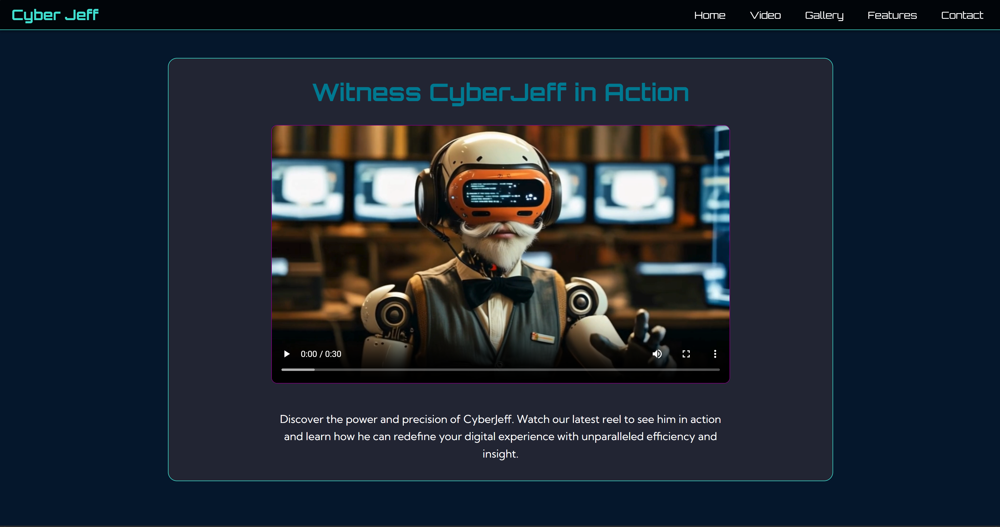
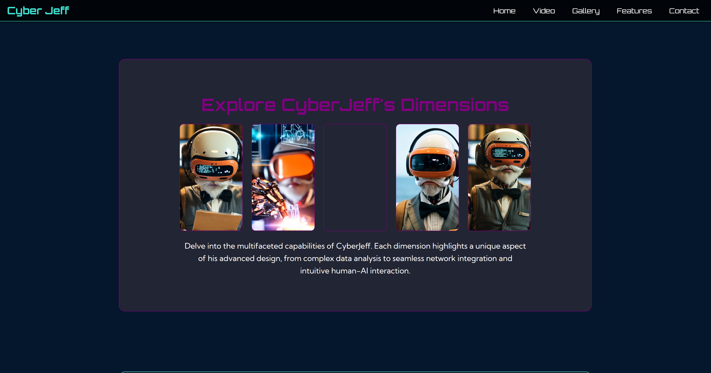
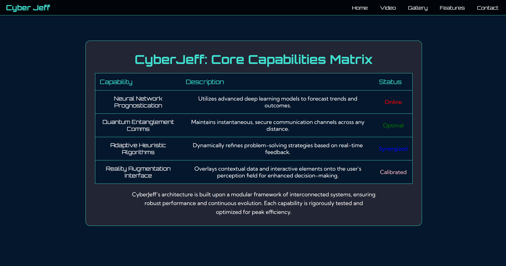
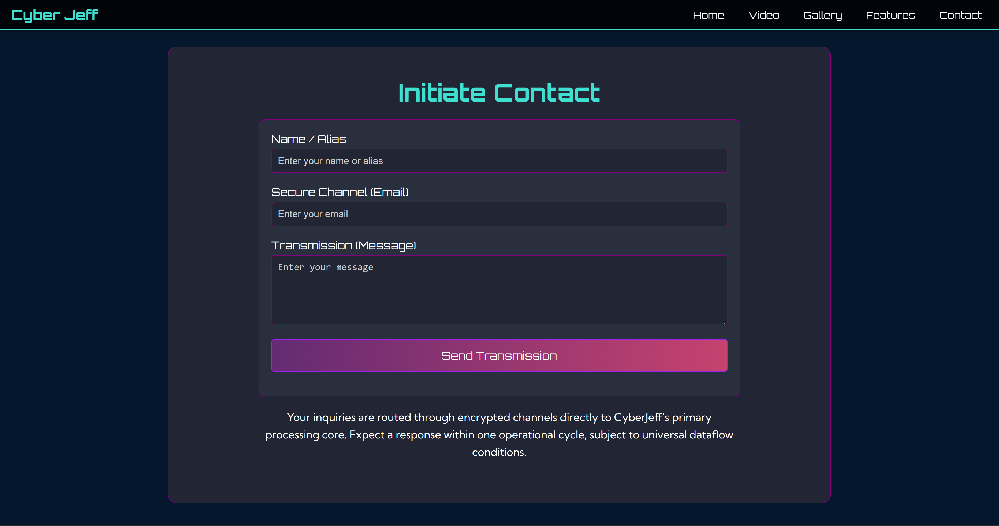
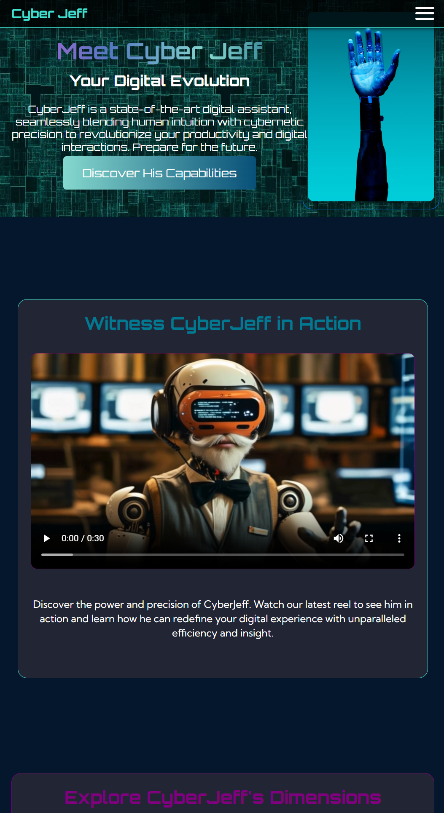

# Cyber Jeff Website

Here’s a professional and comprehensive README.md file about this website:

---

# Cyber Jeff - Your Digital Evolution

Welcome to **Cyber Jeff**, a state-of-the-art digital assistant website that seamlessly blends human intuition with cybernetic precision. This project showcases a sleek, responsive design optimized for desktop, tablet, and mobile devices.

---

## 🌟 Features

- **Hero Section**: Introduces Cyber Jeff with a captivating tagline and call-to-action button.
- **Video Section**: Watch Cyber Jeff in action with a responsive video player.
- **Gallery Section**: Explore Cyber Jeff's dimensions with an interactive gallery.
- **Features Section**: A detailed table showcasing Cyber Jeff's core capabilities, dynamically adjusted for mobile view.
- **Contact Section**: A secure and user-friendly contact form for inquiries.
- **Responsive Design**: Fully optimized for desktop, tablet, and mobile devices.

---

## 📱 Responsive Design Highlights

- **Mobile View**:
  - Hero image and button perfectly centered.
  - Table rows transformed into vertical columns with headers displayed above content.
  - Interactive gallery with hover effects for hidden images.
- **Tablet View**:
  - Adjusted font sizes and padding for better readability.
  - Navigation menu aligned for a clean layout.
- **Desktop View**:
  - Full-width layout with balanced spacing and visuals.

---

## 🚀 Technologies Used

- **HTML5**: Semantic structure for better accessibility and SEO.
- **CSS3**: Modern styling with media queries for responsiveness.
- **Font Awesome**: Icons for social media links and visual enhancements.

---

## 📂 File Structure

```
Cyber-Jeff/
├── assets/
│   ├── images/       # Images used in the website
│   ├── video/        # Video file for the video section
├── components/
│   ├── style.css     # Main CSS file for styling
├── index.html        # Main HTML file
```

---

## 🖥️ How to View the Website

1. Clone the repository:
   ```bash
   git clone https://github.com/Udon171/Cyber-Jeff
   ```
2. Open the index.html file in your browser.

---

## ✨ Key Design Choices

- **Interactive Gallery**: Hidden images revealed on hover or long press for mobile users.
- **Mobile-Friendly Navigation**: Burger menu for easy access to sections.
- **Dynamic Table**: Headers displayed above content for better readability on smaller screens.

---

## 🌐 Website Resources Used

Here are the resources that helped bring the Cyber Jeff website to life:

- **Main Font**: [Google Fonts](https://fonts.google.com/selection)
- **Gradient Elements**: [UI Gradients](https://uigradients.com/)
- **Problem Solving (HTML Carousel)**: [W3Schools](https://www.w3schools.com/)
- **Head Icon for Webpage**: [Icons8](https://icons8.com/icons/set/tech)
- **Social Media Icons in Footer**: [Font Awesome](https://fontawesome.com/)
- **Video and Images for Jeff**: [Kling AI](https://app.klingai.com/)

---

## 🧠 My Journey

This project was a rewarding experience, filled with challenges and learning opportunities. Here's a memorable moment from the journey:

> **Memorable Moment**:  
> After implementing a carousel for the design using JavaScript, I pushed myself to explore all possible ways to achieve the same functionality using only HTML and CSS. However, I realized my design was unachievable with these methods. Adapting the design, I used this opportunity to create a static image set with a reveal element for the launch of a new character. Using hidden and hover effects to achieve this was fun and aligned well with the overall feel of the website.

---

## 📜 Additional Resources

- **Mind Map**:  
  

- **Wireframe Mockup**:  
  [Wireframe PDF](assets/resources/CyberJeff%20Wireframe%20design.pdf) 

---

## 📧 Contact

For inquiries or feedback, feel free to reach out via the contact form on the website.

---

### 🎉 Thank You for Exploring Cyber Jeff!

We hope you enjoy this futuristic and responsive website. Feel free to contribute or share your thoughts!

---

### 🌐 Live Website

View the fully built site here:  
[Cyber Jeff Website](https://udon171.github.io/Cyber-Jeff/)

#### Website Screenshots:

1. **Hero Section**  
   

2. **Video Section**  
   

3. **Gallery Section**  
   

4. **Features Section**  
   

5. **Contact Section**  
   

6. **Mobile View**  
   

---