# Cyber Jeff Website

Welcome to **Cyber Jeff**, a cutting-edge digital assistant website that blends human intuition with cybernetic precision. This project showcases a sleek, responsive design optimized for desktop, tablet, and mobile devices. Visit the live site: [Cyber Jeff](https://udon171.github.io/Cyber-Jeff/)

---

## Contents

- [User Goals](#user-goals)
- [User Stories](#user-stories)
- [Website Goals & Objectives](#website-goals--objectives)
- [Wireframes](#wireframes)
- [Design Choices](#design-choices)
  - [Typography](#typography)
  - [Colour Scheme](#colour-scheme)
  - [Images](#images)
  - [Responsiveness](#responsiveness)
- [Features](#features)
  - [Existing Features](#existing-features)
    - [Header](#header)
      - [Instructions](#instructions)
      - [Feedback](#feedback)
    - [Hero](#hero)
    - [Video](#video)
    - [Reveal](#reveal)
    - [Table](#table)
    - [Form](#form)
    - [Footer](#footer)
    - [mobile](#mobile)
- [Technologies Used](#technologies-used)
  - [Languages](#languages)
  - [Libraries](#libraries)
  - [Framework](#framework)
  - [Tools](#tools)
- [Testing](#testing)
  - [Bugs Fixed](#bugs-fixed)
  - [Responsiveness Tests](#responsiveness-tests)
  - [Code Validation](#code-validation)
    - [HTML](#html)
    - [CSS](#css)
  - [User Story Testing](#user-story-testing)
  - [Feature Testing](#feature-testing)
  - [Accessibility Testing](#accessibility-testing)
  - [Lighthouse Testing](#lighthouse-testing)
  - [Browser Testing](#browser-testing)
  - [Informative Action](#informative-action)
  - [Recomended Updates](#recommended-updates)
- [Deployment](#deployment)
  - [To Deploy the Project](#to-deploy-the-project)
  - [To Fork the Project](#to-fork-the-project)
  - [To Clone the Project](#to-clone-the-project)
- [Visit Website](#visit-website-cyber-jeff)
- [Credits](#credits)

---

## User Goals

Cyber Jeff is designed for tech-savvy professionals, entrepreneurs, students, and everyday internet users aged 16 and above. The primary goals for users are to:
- Access a reliable digital assistant to streamline workflows and coordinate tasks across multiple AI platforms.
- Explore and interact with an intuitive, visually appealing website that showcases AI capabilities.
- Easily contact the team for inquiries or feedback through a user-friendly form or social media links.
- Experience seamless navigation and functionality across devices, from mobile to desktop.

[Return to Index](#contents)

---

## User Stories

- As a **tech professional**, I want to explore Cyber Jeff’s features so I can understand how it integrates with my existing AI tools.
- As a **student**, I want a clear and engaging website to learn about AI-powered digital assistants.
- As a **business owner**, I want to contact the Cyber Jeff team to inquire about potential integrations or partnerships.
- As a **casual user**, I want a responsive and visually appealing website that works flawlessly on my mobile device or desktop.
- As a **developer**, I want to view the project’s code and documentation to understand its structure and contribute to its development.

[Return to Index](#contents)

---

## Website Goals & Objectives

- **Showcase Cyber Jeff**: Highlight the capabilities of Cyber Jeff as a digital assistant through engaging visuals, a feature table, and a demo video.
- **Ensure Accessibility**: Provide a website that adheres to WCAG standards for accessibility, with semantic HTML and descriptive alt text.
- **Optimize Responsiveness**: Deliver a seamless user experience across devices, with tailored layouts for mobile, tablet, and desktop.
- **Enable Interaction**: Offer interactive elements like a gallery reveal and a contact form to engage users.
- **Facilitate Deployment**: Provide clear instructions for cloning, forking, and deploying the project for developers and contributors.

[Return to Index](#contents)

---

## Wireframes

Wireframes were created to plan the layout and structure of the website. They are available here:  
[Wireframe (PDF)](docs/Jeff%20wireframe%20design.pdf)

<div style="display: flex; flex-direction: column; gap: 1rem; max-width: 600px; margin: 0 auto;">

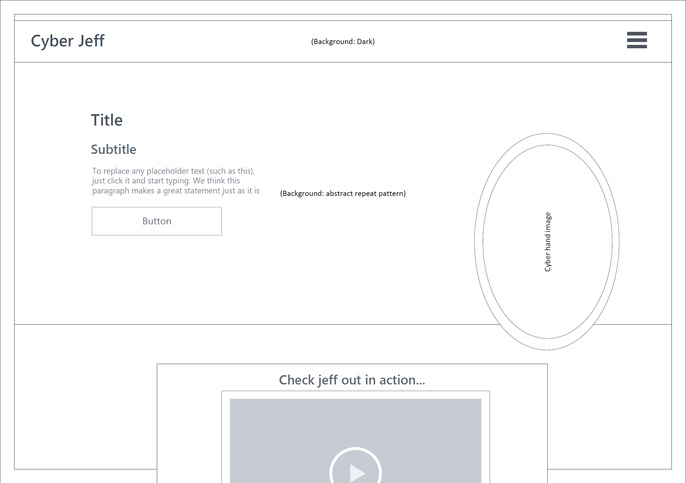
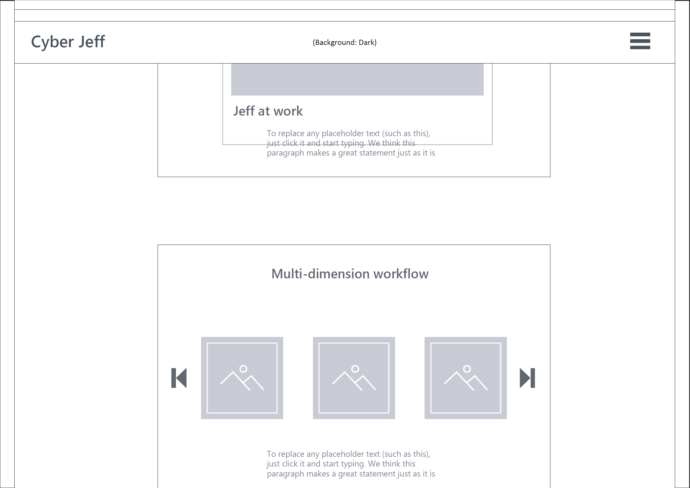
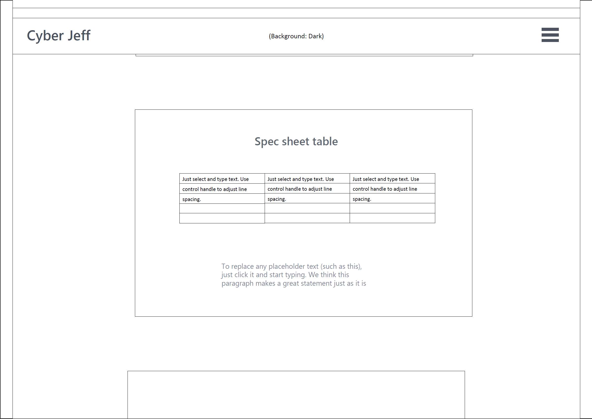
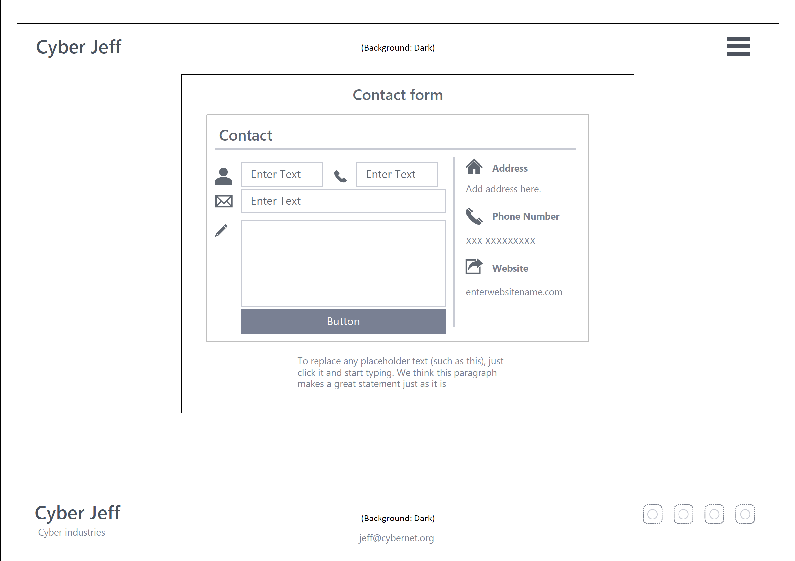

</div>

[Return to Index](#contents)

---

## Design Choices

### Typography
- **Primary Font**: Sourced from [Google Fonts](https://fonts.google.com/selection), chosen for its modern, clean aesthetic and readability across devices.
- **Font Sizes**: Adjusted dynamically with CSS media queries to ensure legibility on mobile (16px base), tablet (18px base), and desktop (20px base).
- **Hierarchy**: Semantic headings (h1, h2, h3) used to maintain structure and accessibility.

### Colour Scheme
- **Palette**: A futuristic gradient palette sourced from [UI Gradients](https://uigradients.com/), featuring blues and purples to evoke technology and innovation.
- **Contrast**: High contrast ratios (minimum 4.5:1) to meet WCAG accessibility standards, ensuring text is readable against backgrounds.
- **Consistency**: Repeated color patterns for buttons, links, and backgrounds to maintain a cohesive look.

### Images
- **Hero Image**: A bold, futuristic image of Cyber Jeff to capture attention and set the tone.
- **Gallery Images**: Interactive images that reveal additional content on hover or tap, created using [Kling AI](https://app.klingai.com/).
- **Alt Text**: Descriptive alt text for all images to enhance accessibility for screen readers.

### Responsiveness
- **Mobile**: Burger menu for navigation, vertically stacked table rows with headers above content, and touch-friendly gallery interactions.
- **Tablet**: Adjusted padding and font sizes for better readability, with a centered layout for balance.
- **Desktop**: Full-width layout with balanced spacing, optimized for large screens with hover effects for interactivity.

[Return to Index](#contents)

---

## Features

### Existing Features

#### Header
- **Navigation Menu**: A responsive burger menu for mobile and a horizontal menu for desktop, providing easy access to all sections.
- **Branding**: Displays the Cyber Jeff logo and tagline for brand consistency.

##### Instructions
- A dedicated modal (accessible via the info button) provides clear instructions on how to use Cyber Jeff’s features.

<div align="center">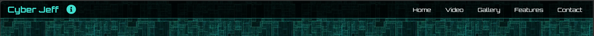</div>

##### Feedback
- A feedback link in the header directs users to the contact form or social media for sharing thoughts and suggestions.

#### Hero
- A bold hero section with a captivating tagline, high-quality image, and a call-to-action button to encourage exploration.
  
  <div align="center">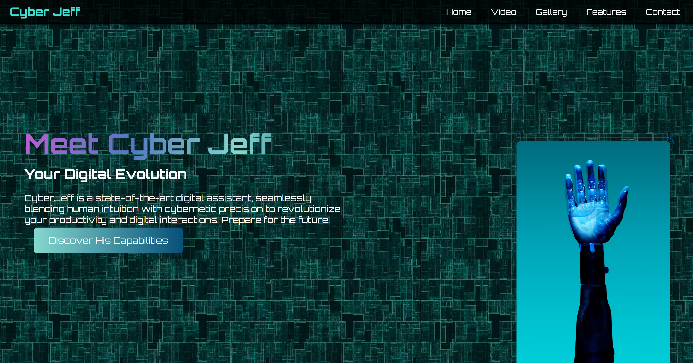</div>

#### Video
- **Video Section**: Features an embedded demo video showcasing Cyber Jeff in action, allowing users to see its capabilities visually firsthand.
  
  <div align="center">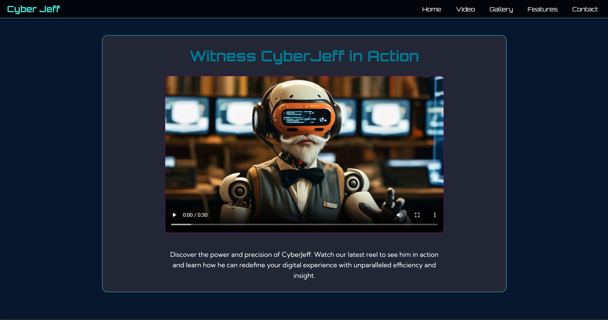</div>

#### Reveal
- An interactive gallery section where images reveal additional content on hover (desktop) or tap (mobile), enhancing engagement.
  
  <div align="center">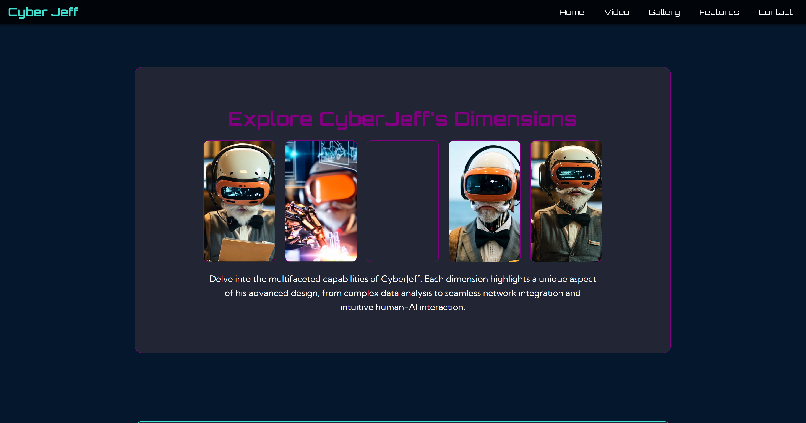</div>

#### Table
- A features table showcasing Cyber Jeff’s capabilities, with headers dynamically displayed above content on mobile for clarity.
  
  <div align="center">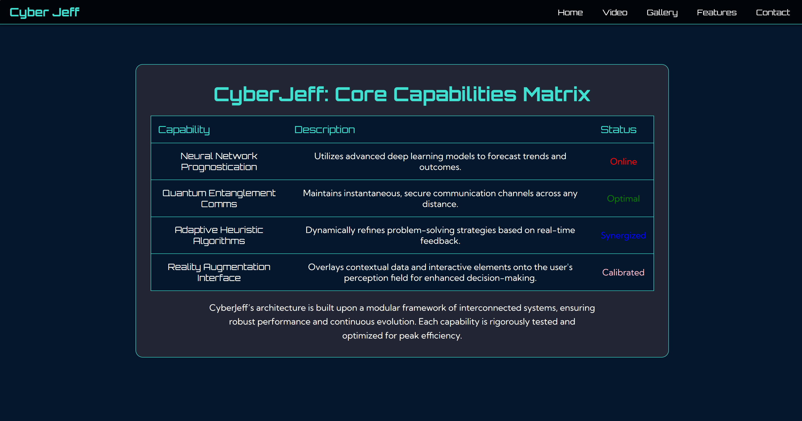</div>

#### Form
- A contact form with required fields and client-side validation, allowing users to send inquiries (requires server-side support for full functionality).
  
  <div align="center">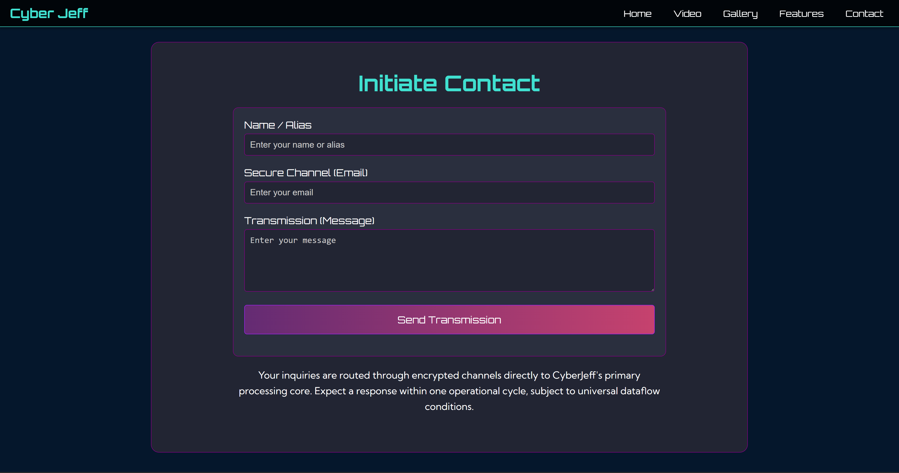</div>

#### Footer
- Contains social media icons (via [Font Awesome](https://fontawesome.com/)) linking to Cyber Jeff’s profiles, and an email link for direct contact.

  <div align="center">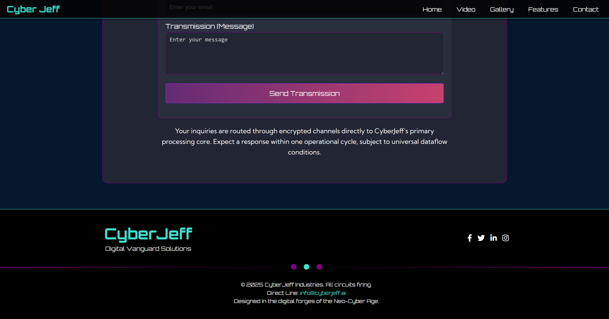</div>

#### Mobile
- The website layout adapts seamlessly to mobile devices, featuring a burger menu, touch-friendly interactions, and vertically stacked content for optimal usability.
  
  <div align="center">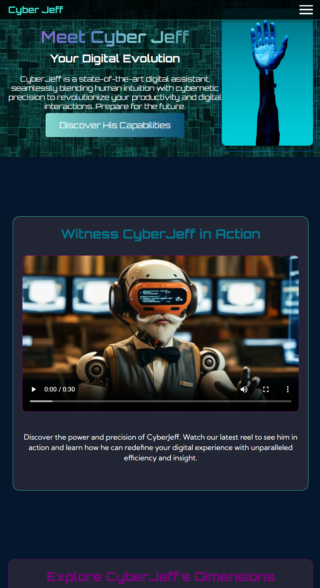</div>
  
[Return to Index](#contents)

---


## Technologies Used

### Languages
- **HTML5**: For semantic structure and accessibility.
- **CSS3**: For styling, animations, and responsive design with media queries.

### Libraries
- **Font Awesome**: For social media and decorative icons.
- **Google Fonts**: For modern, readable typography.

### Framework
- None used, as the project relies on vanilla HTML and CSS for simplicity and performance.

### Tools
- **GitHub**: For version control and hosting via GitHub Pages.
- **Visual Studio Code**: For code editing and Live Server preview.
- **Canva**: For video editing and image creation.
- **Kling AI**: For generating video and image assets.
- **GitHub Copilot**: For assisted coding during development.
- **Icons8**: For the browser favicon.

[Return to Index](#contents)

---

## Testing

### Bugs Fixed
- **Hero Button Margin Issue**: Initially, the hero button ignored margin settings. Resolved by applying `display: inline-block` in CSS, avoiding the use of `!important`.

- **Form Submission Failure**: The contact form failed on GitHub Pages, HTML changed to `method="GET"` and removed `opener` function, meassge moved and re-named to success in turn this fixed the form issues.

- **Discover His Capabilities Failure**: On GitHub Pages the first button in the hero lost its hover effect due to limitations of GitHub Pages (link still works fine).

<div align="center" style="overflow-x:auto; font-size:1.15em;">

| Date       | Item                         | Function/Feature                        | Pass/Fail |
|------------|------------------------------|-----------------------------------------|-----------|
| 2025-05-16 | Discover Button              | Opens Facebook profile in new tab       | Pass      |
| 2025-05-16 | Burger Menu                  | Opens/closes navigation menu            | Pass      |
| 2025-05-16 | Gallery Hidden Image         | Reveals image on hover/press            | Pass      |
| 2025-05-16 | Pop-out Website Links        | Opens external sites in new tab         | Pass      |
| 2025-05-16 | Video Controls               | Play/pause/mute video                   | Pass      |
| 2025-05-16 | Features Table               | Responsive, headers above content       | Pass      |
| 2025-05-16 | Form Button                  | Submits contact form                    | Fail      |
| 2025-05-16 | Mobile Responsiveness        | Layout adapts to mobile devices         | Pass      |
| 2025-05-16 | Large Display Responsiveness | Layout adapts to large screens/desktops | Pass      |

</div>

### Responsiveness Tests
- **Mobile**: Tested on iPhone 12 and Samsung Galaxy S21; burger menu, table layout, and gallery reveal worked seamlessly.
- **Tablet**: Tested on iPad Air; font sizes and padding adjusted correctly, with no horizontal scrolling.
- **Desktop**: Tested on 1920x1080 and 2560x1440 resolutions; full-width layout and hover effects functioned as expected.

### Code Validation

#### HTML
- Validated using [W3C HTML Validator](https://validator.w3.org/).
- Result: No errors found. Screenshot: 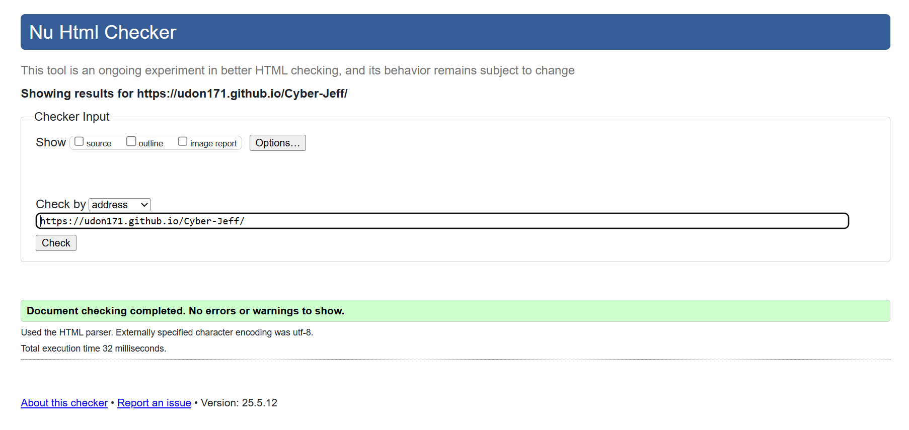

#### CSS
- Validated using [W3C CSS Validator](https://jigsaw.w3.org/css-validator/).
- Result: No errors found. Screenshot: 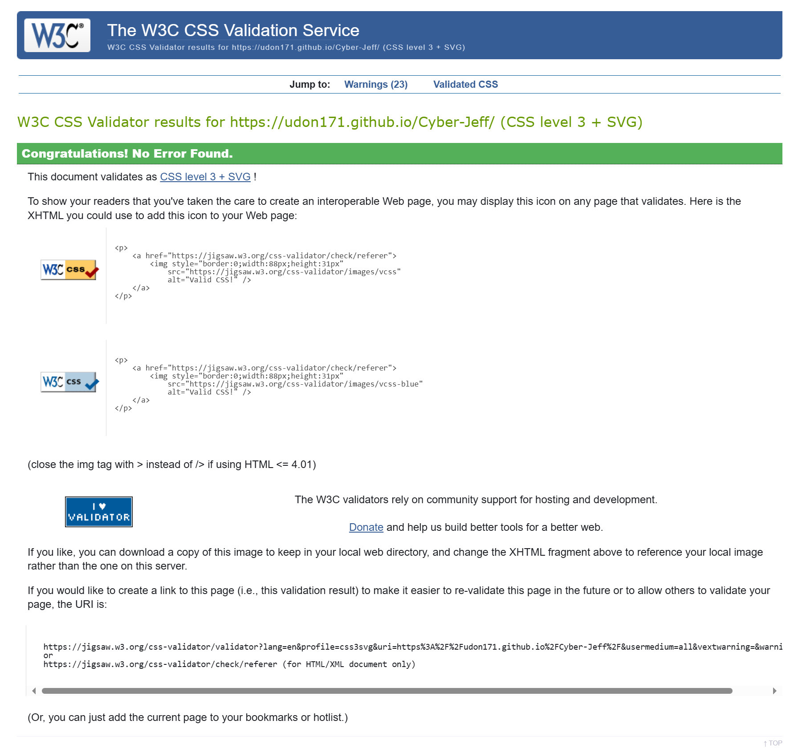

### User Story Testing
- **Tech Professional**: Successfully explored features via the table and video section.  
  <div align="center">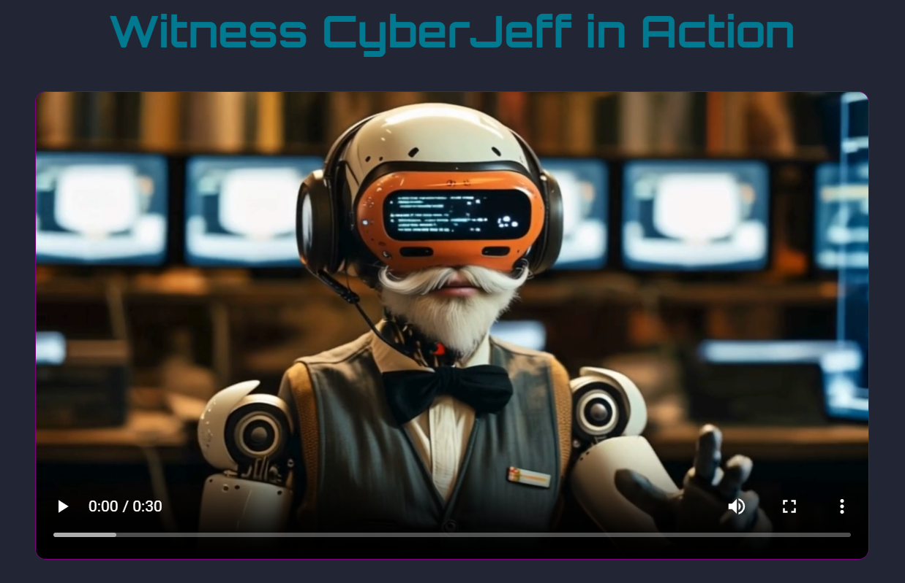</div>

- **Student**: Found the hero and gallery sections engaging and easy to navigate.  
  <div align="center">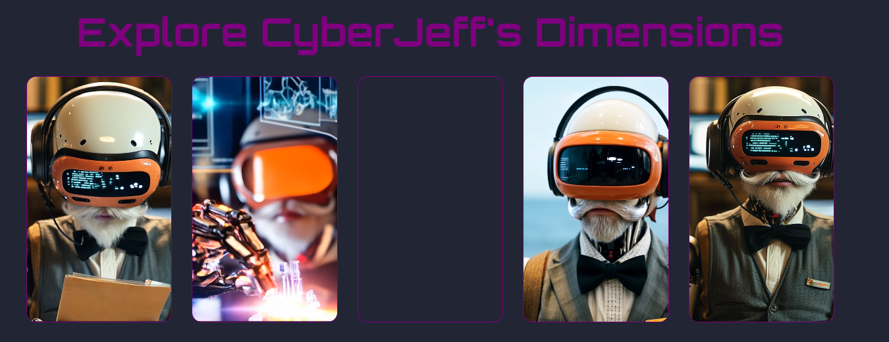</div>

- **Business Owner**: Contact form and footer links provided clear communication options.  
  <div align="center">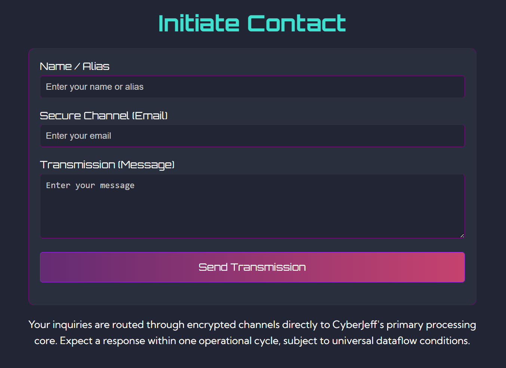</div>

- **Casual User**: Mobile and desktop experiences were intuitive and responsive.  
  <div align="center">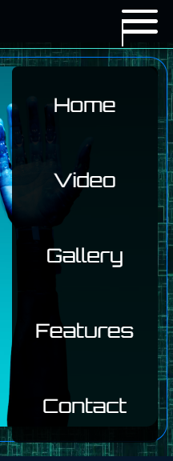</div>

- **Developer**: README and file structure provided clear documentation for contribution.  
  <div align="center"></div>


### Feature Testing
- **Header**: Navigation menu opened/closed correctly; feedback link directed to contact form.
- **Hero**: Call-to-action button linked correctly and was visually prominent.
- **Reveal**: Gallery images revealed content on hover/tap across devices.
- **Table**: Headers displayed above content on mobile, with no data loss.
- **Form**: Client-side validation worked, but submission failed on GitHub Pages (noted limitation).
- **Footer**: Social media and email links opened in new tabs or email clients.

### Accessibility Testing
- Tested using [Wave Accessibility Tool](https://wave.webaim.org/).
- Results: High contrast ratios, proper ARIA labels, and descriptive alt text ensured WCAG compliance.
- Screenshot: 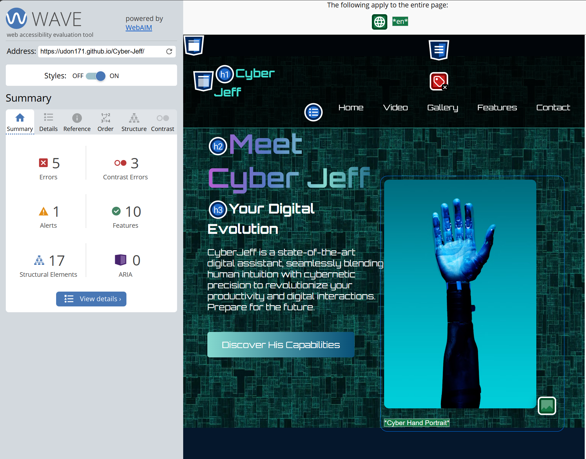

### Lighthouse Testing
- Tested using [Lighthouse](https://web.dev/measure/).
- **Mobile Results**: [Link](https://pagespeed.web.dev/analysis/https-udon171-github-io-Cyber-Jeff/teqg1zn5fv?form_factor=mobile)
- **Desktop Results**: [Link](https://pagespeed.web.dev/analysis/https-udon171-github-io-Cyber-Jeff/teqg1zn5fv?form_factor=desktop)
- Screenshot: 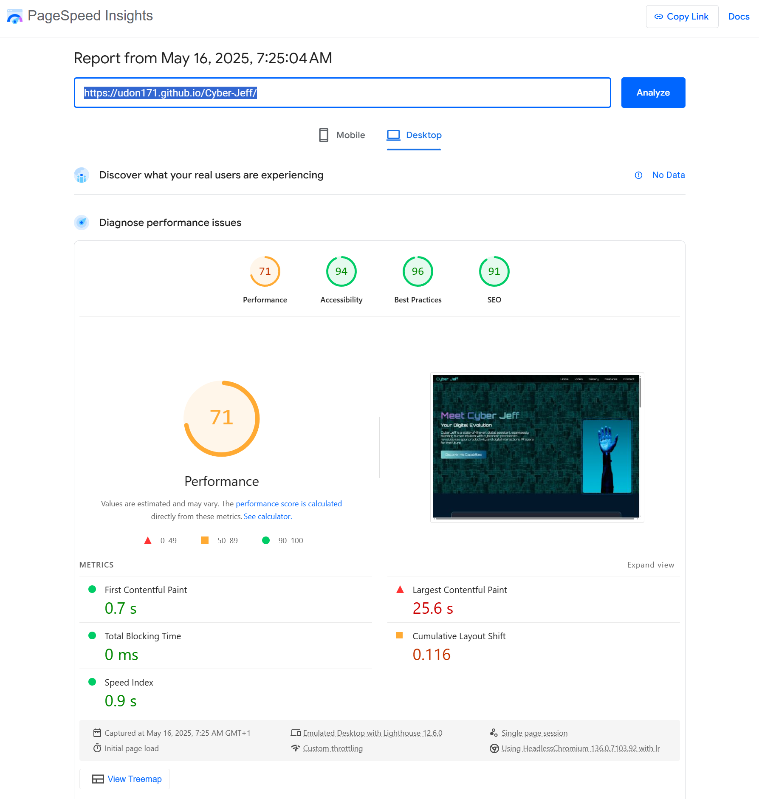
- Scores: Performance (71), Accessibility (94), Best Practices (96), SEO (90+).

### Browser Testing
- Tested on Chrome, Firefox, Safari, and Edge across Windows, macOS, iOS, and Android.
- Results: Consistent rendering, functionality, and responsiveness across all browsers.

### Informative Action
A new performance report is available for review:

- [Cyber Jeff Performance Report (PDF)](docs/cyber-jeff-performance-report.pdf)

This report provides detailed insights into the website’s speed, accessibility, and overall user experience, including recommendations for further optimization. Reviewing this document will help maintain and improve the quality and performance of the Cyber Jeff website.

### Recommended Updates
- Convert all site image files from PNG to WebP format for improved performance.
- Optimize the hero background image by reducing its resolution or embedding it directly in the HTML instead of using CSS.

[Return to Index](#contents)

---

## Deployment

### To Deploy the Project
1. **Prepare Files**: Ensure all files (`index.html`, `assets/`, `docs/`, `success.html/`, `popup.html/`) are in the project directory.
2. **Choose a Hosting Provider**:
   - **GitHub Pages**: Push to a GitHub repository, go to **Settings > Pages**, select the `main` branch and `/` (root) folder, and save.
   - **Netlify/Vercel**: Create a new site, connect your GitHub repository or upload the project folder, and deploy.
   - **FTP Hosting**: Use an FTP client like FileZilla to upload files to the `public_html` directory.
3. Verify the live URL provided by the hosting service.

### To Fork the Project
1. Go to the [Cyber Jeff repository](https://github.com/Udon171/Cyber-Jeff).
2. Click the **Fork** button in the top-right corner.
3. Clone your forked repository to your local machine for modifications.

### To Clone the Project
1. Run the following command in your terminal:
   ```bash
   git clone https://github.com/Udon171/Cyber-Jeff
   ```
2. Open the `Cyber-Jeff` folder in Visual Studio Code.
3. Preview `index.html` using Live Server or open it in a browser.

[Return to Index](#contents)

---

## Visit Website Cyber Jeff
Experience Cyber Jeff in action—explore the live site now!

👉 [Launch Cyber Jeff Website 🚀](https://udon171.github.io/Cyber-Jeff/)

---

## Credits

- **Fonts**: [Google Fonts](https://fonts.google.com/selection)
- **Gradients**: [UI Gradients](https://uigradients.com/)
- **Icons**: [Font Awesome](https://fontawesome.com/), [Icons8](https://icons8.com/icons/set/tech)
- **Video/Images**: [Kling AI](https://app.klingai.com/)
- **Video Editing**: [Canva](https://www.canva.com/)
- **Coding Assistance**: [GitHub Copilot](https://github.com/features/copilot)
- **HTML/CSS Reference**: [W3Schools](https://www.w3schools.com/)
- **Inspiration**: The developer’s passion for AI and responsive web design.
- **Training Reference**: [Code Institute](https://www.codeinstitute.net)

[Return to Index](#contents)

---

Stay Frosty!
